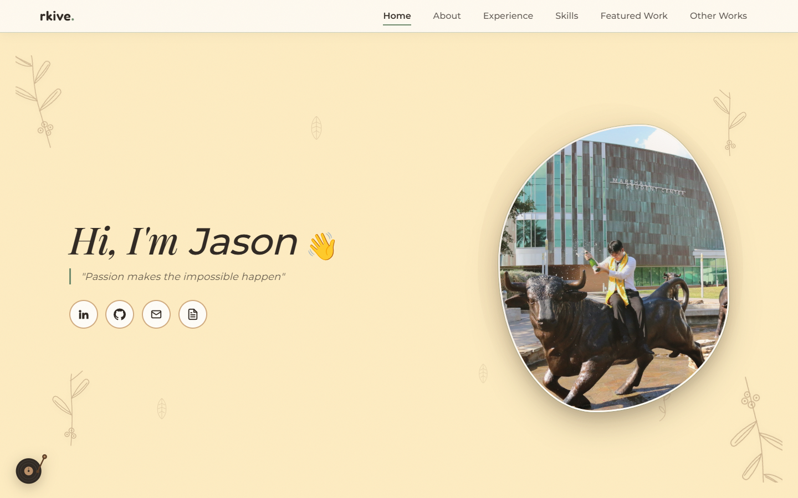
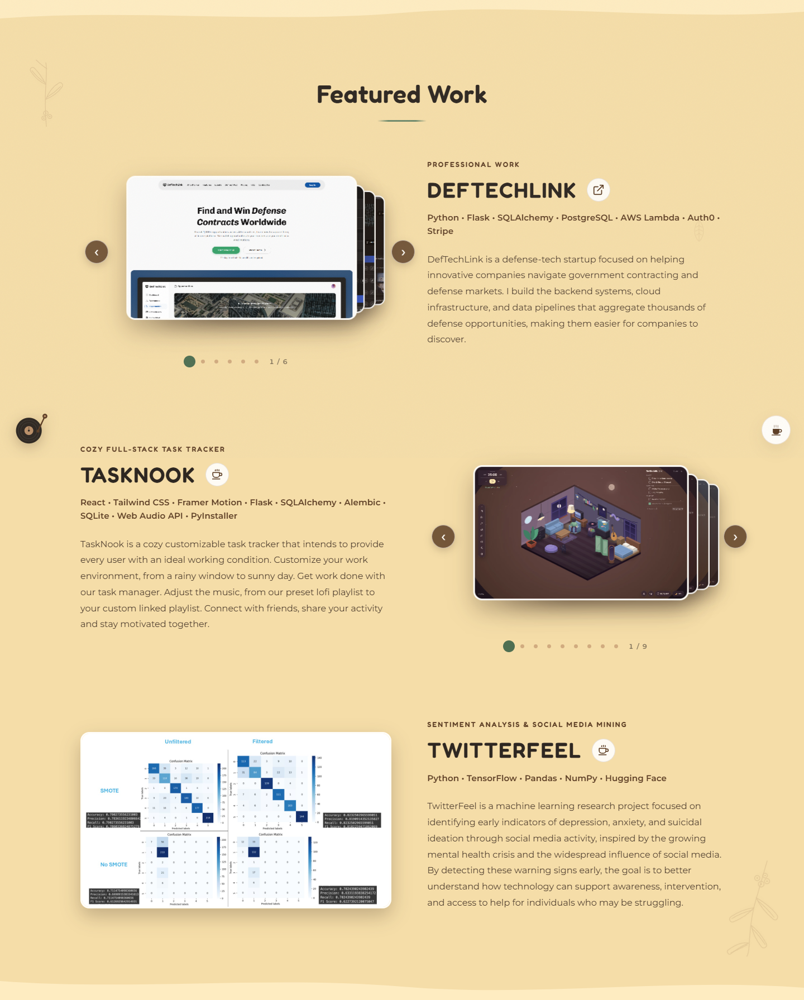
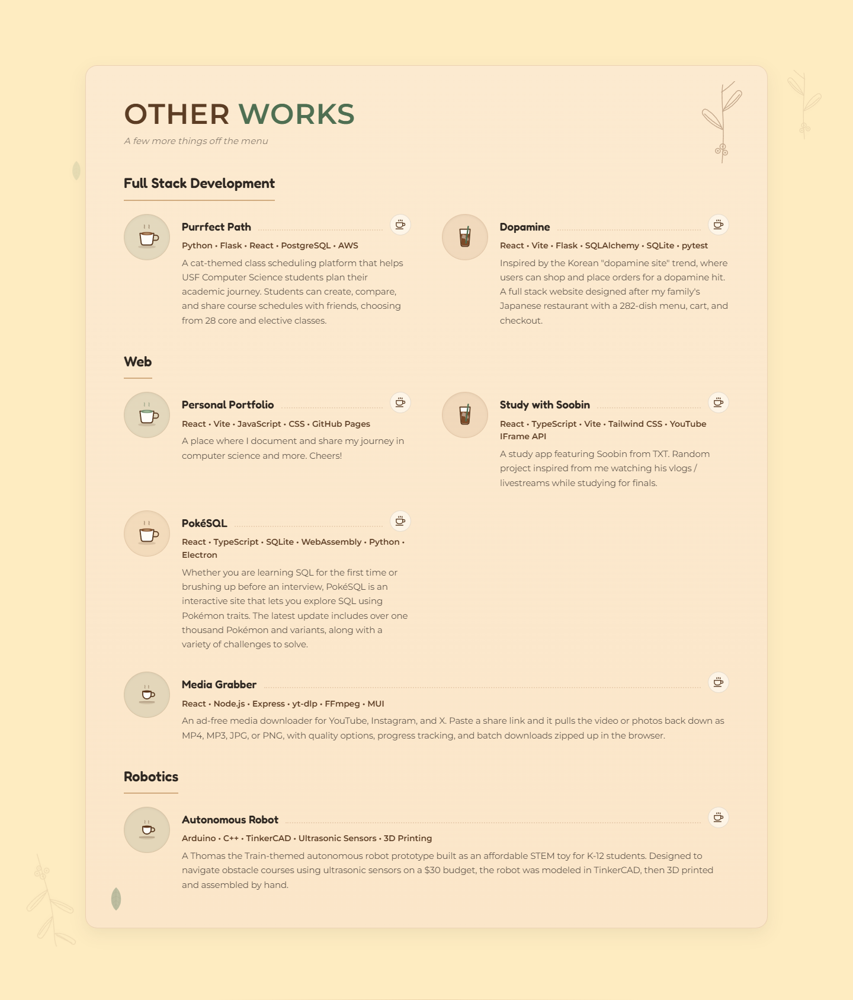
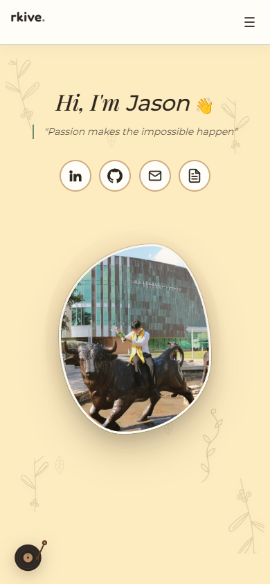

# Portfolio screenshots

Captured from the running portfolio using headless Chrome and the Chrome DevTools Protocol, following TaskNook's screenshot workflow. The script starts its own local Vite server and uses a temporary browser profile.

## Desktop

### Home



### Featured Work



### Other Works



## Mobile



## Regenerate

Requires Node.js 22+ and Chrome, Chromium, or Microsoft Edge. From the repository root:

```bash
npm install
npm run screenshots
```

In Windows PowerShell, use `npm.cmd` if script execution is restricted. Set `CHROME_PATH` to the browser executable if it is not installed in one of the standard locations supported by the script.

The committed [capture script](../../scripts/screenshots.mjs) waits for the loader, fonts, and images, uses the site's reduced-motion mode, and checks for horizontal overflow. Desktop home uses a 1440 × 900 viewport; mobile home uses 390 × 844. Project screenshots capture the entire section at 1440 pixels wide. No site content is mocked or rewritten for the captures.

After regenerating, inspect each image for clipped text, missing assets, and layout changes before committing it.
